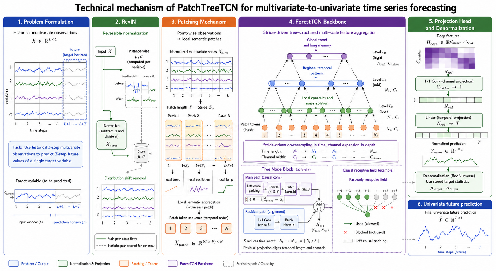

# PatchTreeTCN: A Robust and Efficient Multi-Scale Convolutional Architecture for Long-Term Time Series Forecasting


This repository contains the official PyTorch implementation for the paper: **"PatchTreeTCN: A Robust and Efficient Multi-Scale Convolutional Architecture for Long-Term Time Series Forecasting"**.

## 📖 Introduction



**PatchTreeTCN** is a novel deep learning architecture designed for Long-Term Time Series Forecasting (LTSF). It elegantly combines the power of **Patching** mechanisms with a structurally optimized **Tree-Temporal Convolutional Network (ForestTCN)**. By transforming time series into patches and processing them through a hierarchical multi-scale convolutional structure, PatchTreeTCN effectively captures both local semantic information and long-range global dependencies while maintaining high computational efficiency.

### ✨ Key Features
- **Patching Mechanism:** Segments time series into sub-sequence patches to retain local semantic information and significantly reduce the computational bottleneck of long sequences.
- **ForestTCN (Tree-structured TCN):** A deeply optimized multi-level convolutional network using `GELU` activations, Causal Padding, and robust residual connections to expand the receptive field exponentially without gradient vanishing.
- **RevIN (Reversible Instance Normalization):** Incorporates dynamic normalization and denormalization to effectively handle non-stationary time series and distribution shifts.
- **Robust & Efficient:** Outperforms standard Transformers and CNNs in LTSF tasks with a smaller memory footprint and faster inference speed.

## 📂 Project Structure

```text
PatchTreeTCN1/
├── EET/                # Experiments on ETT datasets
├── ILI/                # Experiments on ILI dataset
├── electricity/        # Experiments on Electricity dataset
├── exchange_rate/      # Experiments on Exchange Rate dataset
├── traffic/            # Experiments on Traffic dataset
├── weather/            # Experiments on Weather dataset
├── tree_tcn.py         # Core Implementation of ForestTCN & TreeNodeBlock
├── run_all.sh          # Shell script to run all benchmark experiments
├── README.md           
└── LICENSE             
```

Each dataset directory (e.g., `weather/`) contains:
- `data/` - Dataset files (zipped CSVs).
- `main.py` - Training and evaluation pipeline.
- `model.py` - The PatchTreeTCN model assembling RevIN, Patching, and ForestTCN.
- `utils.py` - Data loading and processing utilities.

## 🚀 Getting Started

### 1. Requirements

- Python 3.8+
- PyTorch 1.9.0+
- NumPy
- Pandas
- scikit-learn

Install the required packages:
```bash
pip install torch numpy pandas scikit-learn
```

### 2. Data Preparation

The datasets are included in their respective `data/` directories as `.zip` files. Depending on your `utils.py` implementation, you may need to unzip them before running:

```bash
unzip weather/data/weather.csv.zip -d weather/data/
# Repeat for other datasets...
```

### 3. Training & Evaluation

To run a single experiment (e.g., on the Weather dataset):

```bash
python -m weather.main \
    --seq_len 96 \
    --pred_len 720 \
    --patch_size 4 \
    --levels 3 \
    --nhid 64 \
    --batch_size 32 \
    --epochs 50 \
    --lr 1e-5
```

**Key Hyperparameters:**
- `--seq_len`: Look-back window size (default: 96).
- `--pred_len`: Forecasting horizon (e.g., 96, 192, 336, 720).
- `--patch_size`: Size of each patch (default: 4).
- `--levels`: Number of levels in the ForestTCN tree (default: 3).
- `--nhid`: Hidden channels in TCN layers (default: 64).
- `--stride`: Stride size for the convolutional layers (default: 2).
- `--dropout`: Dropout probability (default: 0.4).

### 4. Run All Benchmarks

You can reproduce all experiments sequentially using the provided shell script:

```bash
chmod +x run_all.sh
./run_all.sh
```
This will sequentially execute `main.py` for `weather`, `EET`, `electricity`, `exchange_rate`, `ILI`, and `traffic`.

## 📊 Logging and Results

Logs, best models, and evaluation metrics (MAE, RMSE, MAPE) are automatically saved in the `logs/<dataset>_<timestamp>/` directory for each run. Early stopping is implemented to prevent overfitting.

## 📝 Citation

If you find this repository useful for your research, please consider citing our paper:


## 📄 License

This project is licensed under the MIT License - see the [LICENSE](LICENSE) file for details.
